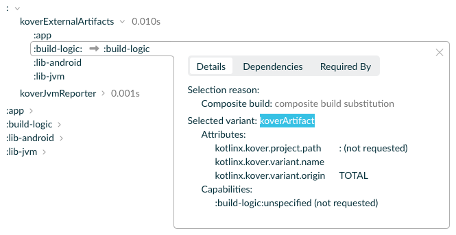
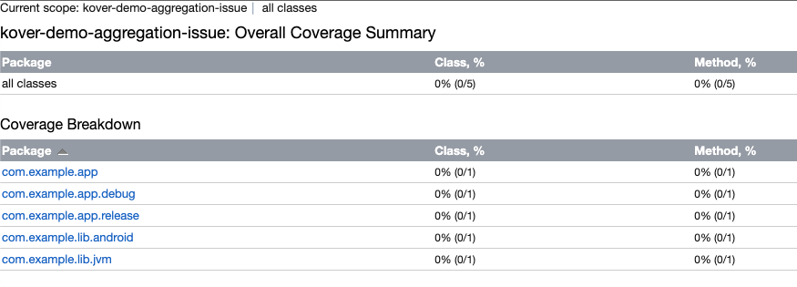
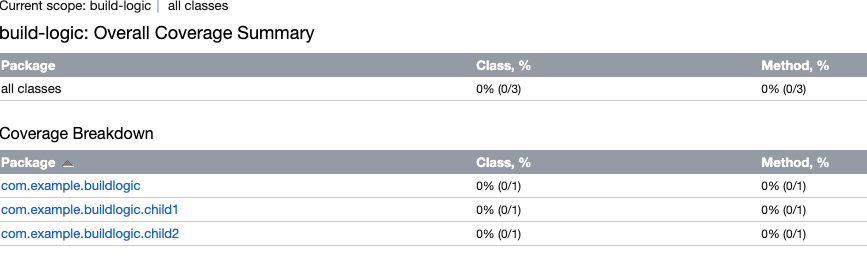
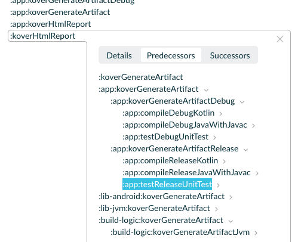

# kover-demo-aggregation-issue
Documentation repository to showcase issues when applying the current `kover` beta version on a complex Android/JVM monolith project

## Issues

### `includedBuild`s not aggregating
`kover` integrates with Gradle's dependency resolution system by exposing a `kover` configuration to aggregate projects 

As `includedBuild`s by convention exposes a dependency coordinate (implicit `dependencySubstitution`), declaring it as a `kover` dependency is expected to aggregate the child build into the main report.

```kotlin
dependencies {
    kover(":build-logic")
}
```

This setup does not break the build, the correct `koverArtifact[TOTAL]` variant is resolved for the included build, but the report does not aggregate it.

https://scans.gradle.com/s/2nb3nedv4ntsm/dependencies?focusedDependency=WzAsMCwyLFswLDAsWzJdXV0&toggled=W1swXSxbMCwwXV0

Running `./gradlew :koverHtmlReport` produces a report only containing main build modules:


While running `./gradlew :build-logic:koverHtmlReport`, is correctly computing the `build-logic` modules (some now not aggregated in the root one):


### Missing variant filtering when aggregating Android projects
Since `0.8.0-Beta2`, Kover successfully aggregates Android modules.

Given the following setup at the root project:
```kotlin
dependencies {
    kover(":app")
    kover(":lib-android")
    kover(":lib-jvm")
}
```
Will produce correctly an aggregated report, taking `main` variant on JVM modules, and all variants (usually `debug` and `release`) on Android ones.

However, this is a problem (at least for us) in large-scale projects, with either complex variants (by using `productFlavor`s for instance) or a large number of modules, as it will cause tall tests to run (`testDebug` and `testRelease` for instance), increasing the overall CI time exponentially.

We'd like to have granular control on which variants are aggregated.

https://scans.gradle.com/s/2nb3nedv4ntsm/timeline?details=txc6dqjkewdsm&expanded=WyIwLjEiXQ&show=predecessors
